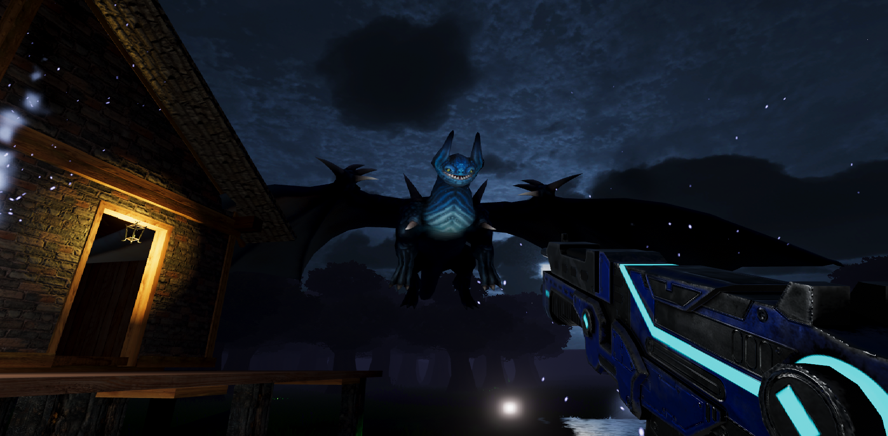

# 2019 - Unity-3D-FPS-Sandbox-Game
Personal Project (WIP) - 3D Sandbox shooter game made with Unity and C#

Link to Youtube video of game: https://youtu.be/vs0OHOFWpmY

  FPS Controls: 
  
    Arrow keys/WASD to move
    Left mouse click to fire projectile
    Hold shift to sprint
    Press f to toggle flashlight
    Press E to mount Dragon

  Dragon Controls:
  
    Arrow keys/WASD to move
    Left mouse click to breathe fire
    Space key to fly up
    X key to fly down
    Hold shift to fly faster
    Press E to dismount Dragon
    
Assets used from Asset Store:\
Note: Assets used from store only for visual purposes. (I.E. House models, rock models, etc):

    AllSkyFree
    ErbGameArt
    Fantasy Forest Environment Free Sample
    Fantasy Monster
    Free Dragons
    Lanterns and Candles
    Medieval Buildings
    Rocks and Boulders 2
    Round Tower
    Sci Fi Gun Light
  
